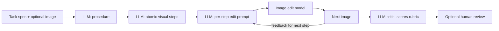

# From Text Answers to Interactive Interfaces — MVP Plan

> Status: Stages 0-1 complete; Stage 2 (real Claude LLM adapter) implemented
> and tested, Experiment 1 pending. This document is the source of truth for
> the first milestone. See `docs/DECISIONS.md` for a running log of decisions
> made while executing this plan.

## A. Research and engineering plan (concise)

**Hypothesis.** A small pipeline of `task -> procedure -> atomic visual steps -> per-step image edits` can generate useful chatbot-style visual guidance, *if* steps are constrained to single, image-visible state changes and the editor preserves background identity.

**MVP scope.** End-to-end pipeline on 5-20 hand-curated tasks across two domains (physical repair, software UI). Mock LLM and mock image-editor first; one real provider behind each adapter at Stage 2-3. No scraping; manual task descriptions only.

**What we want to learn (in priority order):**
1. Can an LLM reliably decompose a procedure into atomic, *visualizable* steps?
2. Does an image-edit model preserve scene identity while applying one localized change?
3. How fast does multi-step chaining drift (image identity, object continuity)?
4. Where does the pipeline fail catastrophically (safety, ambiguity, hallucinated objects)?

**Non-goals (explicit).** No live UI, no user-facing app, no fine-tuning, no large-scale crawling, no realtime interactivity. We are generating *demonstration data*, not serving it.

**Risks and mitigations.**
- Image edit drift on long chains -> measure drift explicitly in Experiment 3; cap chain length.
- Atomic step decomposition is the hardest sub-problem -> dedicate a prompt + critic for it; allow human override.
- Domain ambiguity (physical vs UI) -> keep `domain` field; allow domain-specific prompt overrides.
- Vendor lock-in -> all model access goes through `LLMClient` / `ImageEditClient` / `CriticClient` protocols.



## B. Proposed repo structure

```
interactive-interfaces/
  README.md
  PLAN.md                         # this file
  pyproject.toml                  # deps + console_scripts
  .env.example                    # placeholder API keys, never real
  .gitignore
  prompts/
    procedure_from_task.md
    decompose_to_atomic_steps.md
    image_edit_prompt.md
    critique_step_image.md
  src/interactive_interfaces/
    __init__.py
    schemas/
      __init__.py
      demonstration.py            # pydantic models for Demo + Step
    models/
      __init__.py
      base.py                     # Protocols: LLMClient, ImageEditClient, CriticClient
      mock_llm.py
      mock_image_edit.py
      mock_critic.py
      registry.py                 # name -> client factory
    pipeline/
      __init__.py
      create_demo.py              # task -> demo skeleton + procedure
      decompose.py                # procedure -> atomic steps
      generate_image.py           # one step -> next image
      chain.py                    # iterate generate_image across steps
      critique.py                 # run rubric scoring
    eval/
      __init__.py
      rubric.py                   # scoring data classes
      aggregate.py                # summarize a batch of demos
    utils/
      io.py                       # load/save demo.json, image paths
      prompts.py                  # load prompt templates, render with vars
      logging.py                  # run logger; see section "Logging" below
  scripts/                        # thin CLI wrappers, no logic
    create_demo.py
    decompose_steps.py
    generate_next_image.py
    chain_steps.py
    critique_demo.py
    review_cli.py
  data/
    tasks/                        # input task specs (small JSON)
      wiper_blade.json
      outlook_dark_mode.json
    examples/                     # curated demos, checked into git when small
      wiper-001/
        initial.jpg
        demo.json
        step_0.jpg
    seeds/                        # raw photos/screenshots before they become tasks
  outputs/                        # generated demos (gitignored)
  logs/                           # all run logs (see "Logging" section)
    runs/
    raw/
  docs/
    DECISIONS.md                  # append-only log of decisions and rationale
    EXPERIMENTS.md                # append-only log of experiments and findings
  notebooks/
    01_inspect_demo.ipynb
    02_chain_drift_analysis.ipynb
  tests/
    test_schema.py
    test_pipeline_mock.py
```

Rationale for changes vs. the original sketch: collapsed `src/` under a single package so imports are clean; added `eval/`, `utils/`, `registry.py`, `tests/`, `logs/`, and `docs/`; separated `data/tasks` (inputs) from `data/examples` (curated outputs) from `outputs/` (scratch).

## C. Initial data schema (v0.1)

One **demonstration** per task, stored as `demo.json`. A **JSONL manifest** at `outputs/manifest.jsonl` keeps a flat index for batch evaluation.

Pydantic models live in `src/interactive_interfaces/schemas/demonstration.py`. Sketch:

```python
class Step(BaseModel):
    step_index: int
    current_image_path: Path
    current_state_description: str
    natural_language_instruction: str        # what the user does
    expected_user_action: str                # observable user action verb phrase
    image_generation_prompt: str             # prompt fed to image editor
    image_model: str | None = None
    image_model_params: dict = {}
    generated_next_image_path: Path | None = None
    next_state_description: str | None = None
    safety_notes: list[str] = []
    critique: CritiqueResult | None = None
    failure_modes: list[str] = []
    human_review_status: Literal["pending", "approved", "rejected", "edited"] = "pending"
    quality_score: float | None = None

class Demonstration(BaseModel):
    schema_version: Literal["0.1"] = "0.1"
    task_id: str                              # slug, unique
    domain: Literal["software_ui", "physical_repair", "assembly", "education", "other"]
    user_goal: str
    initial_image_path: Path | None = None
    initial_state_description: str | None = None
    procedure_text: str | None = None         # full LLM narrative
    steps: list[Step] = []
    source_type: Literal[
        "manually_written", "model_generated",
        "user_uploaded", "public_task_description", "synthetic"
    ]
    provenance: Provenance                    # author, date, license, notes
    safety_notes: list[str] = []
    overall_quality_score: float | None = None
    overall_review_status: Literal["pending", "approved", "rejected"] = "pending"
    tags: list[str] = []
    run_log_path: Path | None = None          # pointer to logs/runs/<run_id>/

class CritiqueResult(BaseModel):
    instruction_clarity: int                  # 1-5
    visual_correctness: int
    image_faithfulness: int                   # background/identity preservation
    illustrates_next_step: int
    irrelevant_detail_preservation: int
    safety: int
    overall: int
    rationale: str
    model: str
```

JSONL manifest row (one per step) is a flattened projection used for eval:
`{task_id, step_index, domain, instruction, image_path, next_image_path, critique.overall, human_review_status, run_id}`.

## D. First set of prompt templates

Files under `prompts/`, loaded via `utils/prompts.py` with Jinja-style `{{var}}` interpolation. Each ends with a strict output format spec.

**`prompts/procedure_from_task.md`** — task (+ optional image description) -> numbered procedure with explicit safety section.

```
You are a careful assistant that writes procedural guides.

Task: {{user_goal}}
Domain: {{domain}}
Current scene (optional): {{initial_state_description}}

Write a procedure with:
1. A short safety section listing physical or data risks.
2. A numbered list of steps. Each step describes one observable action.
3. Tools or prerequisites needed.

Do not invent product-specific details that you cannot verify. If a step depends
on a fact you are unsure about, mark it with [UNSURE].

Return JSON: {"safety": [...], "tools": [...], "procedure": ["step 1", ...]}
```

**`prompts/decompose_to_atomic_steps.md`** — procedure -> atomic visual steps.

```
You are converting a procedure into ATOMIC VISUAL STEPS suitable for image
generation. Each atomic step MUST satisfy ALL rules:

R1. Exactly one visible state change.
R2. The change is observable in a static image of the same viewpoint.
R3. The subject of the change is unambiguously identifiable.
R4. No mental or invisible state changes (e.g., "decide", "remember").
R5. No multi-clause actions joined by "and" or "then".
R6. If a viewpoint change is needed, emit a separate {"type": "reframe"} step.
R7. If the step has physical risk, populate `safety_notes`.

Procedure:
{{procedure_json}}

Return JSON list of:
{
  "expected_user_action": "...",            // verb phrase
  "natural_language_instruction": "...",    // shown to the user
  "current_state_description": "...",
  "next_state_description": "...",
  "safety_notes": ["..."]
}
```

**`prompts/image_edit_prompt.md`** — current image + step -> minimal-change edit prompt.

```
You are writing an image editing prompt. The editor will modify the CURRENT
image to depict the NEXT state. Apply the minimum visual change required.

Current image description: {{current_state_description}}
Next state description:    {{next_state_description}}
User instruction:          {{natural_language_instruction}}

Rules:
- Preserve background, lighting, camera angle, and all unrelated objects.
- Change only what the instruction requires.
- Describe the resulting scene, not the action itself.
- Be concrete about positions, objects, and visible attributes.

Return: a single paragraph image-edit prompt, no preamble.
```

**`prompts/critique_step_image.md`** — before image + after image + instruction -> rubric scores.

```
You are evaluating a generated next-step image.

Instruction:           {{natural_language_instruction}}
Expected next state:   {{next_state_description}}

You are shown the BEFORE image and the AFTER image.
Score each criterion 1-5 (5 best) and give a one-sentence rationale per score.

Criteria:
- instruction_clarity:           Is the instruction visualizable and unambiguous?
- visual_correctness:            Does AFTER actually depict the next state?
- image_faithfulness:            Are unrelated parts of BEFORE preserved in AFTER?
- illustrates_next_step:         Would a user understand what to do from AFTER?
- irrelevant_detail_preservation: Background, lighting, identity preserved?
- safety:                        Any unsafe or misleading depiction?
- overall:                       Single holistic score.

Return strict JSON matching the CritiqueResult schema.
```

## E. Staged implementation checklist

Stage gates; do not start a stage before the previous one passes its acceptance check.

**Stage 0 — Skeleton (target: 1 sitting).**
- [ ] Create repo layout from section B.
- [ ] `pyproject.toml` with `pydantic`, `typer`, `pillow`, `jinja2`, `pytest`. No vendor SDKs.
- [ ] Implement `schemas/demonstration.py` and a tiny `test_schema.py`.
- [ ] Implement `utils/logging.py` per the "Logging and experiment tracking" section below; every CLI invocation must produce a `logs/runs/<run_id>/` directory.
- [ ] Seed `docs/DECISIONS.md` and `docs/EXPERIMENTS.md` with a header and the first entry.
- [ ] Hand-author `data/examples/wiper-001/demo.json` with one real photo and one placeholder generated image. Validates against schema.
- Acceptance: `pytest` green; `demo.json` loads; running any CLI script writes a populated `logs/runs/<run_id>/`.

**Stage 1 — Mock pipeline end-to-end.**
- [ ] `models/base.py` Protocols and `mock_*.py` implementations (mock LLM returns templated text; mock image editor copies input image with a text overlay; mock critic returns fixed 3s).
- [ ] `pipeline/create_demo.py`, `decompose.py`, `generate_image.py`, `chain.py`, `critique.py`. Each pipeline call goes through `utils/logging.py` and records the prompt + response (or input image + output image path) to `logs/raw/`.
- [ ] `scripts/*.py` thin CLI wrappers (see section below).
- [ ] Run end-to-end on `wiper_blade.json` and `outlook_dark_mode.json`. Append a one-paragraph summary to `docs/EXPERIMENTS.md`.
- Acceptance: `outputs/<task>/demo.json` exists with >=3 steps and per-step `generated_next_image_path` populated; `logs/runs/<run_id>/run.jsonl` contains one event per pipeline call.

**Stage 2 — Real LLM behind adapter.**
- [ ] Add one real `LLMClient` implementation behind env-var config; selected via `models/registry.py`. Vendor TBD with user; record the choice and the reasoning in `docs/DECISIONS.md`.
- [ ] Re-run Experiment 1 (5 wiper examples) with real procedure + decomposition; keep image editor mock. Append findings to `docs/EXPERIMENTS.md`.
- Acceptance: atomic-step prompt rule violations < 30% on a 20-step sample (manual count, recorded in `docs/EXPERIMENTS.md`).

**Stage 3 — Real image editor behind adapter.**
- [ ] Add one real `ImageEditClient` implementation; vendor TBD; record choice in `docs/DECISIONS.md`.
- [ ] Re-run Experiments 1 and 2. Append findings to `docs/EXPERIMENTS.md`.
- Acceptance: >=60% of generated next-images judged "illustrates next step >=3" by the LLM critic and spot-checked by a human.

**Stage 4 — Chaining + drift study (Experiment 3).**
- [ ] `chain.py` iterates 3-5 steps, feeding each generated image as the next `current_image_path`.
- [ ] `notebooks/02_chain_drift_analysis.ipynb` plots per-step critic scores and background-similarity (SSIM or CLIP cosine).
- [ ] Drift numbers and example failure modes recorded in `docs/EXPERIMENTS.md`.
- Acceptance: chain drift quantified for >=5 tasks.

**Stage 5 — Review CLI + small eval report.**
- [ ] `scripts/review_cli.py`: terminal UI that displays before/after pairs + instruction; lets reviewer mark approve/reject/edit and writes back to `demo.json`. Every review action is appended to the per-run log.
- [ ] `eval/aggregate.py` builds a Markdown report from the JSONL manifest into `outputs/report_<date>.md`.
- Acceptance: a single-command report covering all generated demos.

## Logging and experiment tracking (top-level requirement)

**Principle:** every decision and every model call must be reproducible from logs alone. If it isn't written to a file, it didn't happen.

### What gets logged

1. **Decisions** — architecture, prompt, vendor, and methodology choices. Append-only to `docs/DECISIONS.md`. One entry per decision with: date, decision, options considered, rationale, who made it.
2. **Experiments** — every batch of demos generated for an experiment. Append-only to `docs/EXPERIMENTS.md`. One entry per experiment with: date, experiment id, what changed, dataset, command run, run_id, headline numbers, qualitative notes, link to artifacts.
3. **Raw run logs** — every CLI invocation creates a run directory:
   ```
   logs/runs/<run_id>/
     manifest.json        # run_id, timestamp, git_sha, python version,
                          # command + argv, adapter names + versions,
                          # env vars used (names only, never values),
                          # input file hashes
     run.jsonl            # one JSON event per pipeline step (see below)
     stdout.log           # captured stdout
     stderr.log           # captured stderr
   logs/raw/<run_id>/
     llm/<call_id>.json   # full prompt, full response, model id, params, latency, token counts
     image_edit/<call_id>.json   # input image path + hash, instruction, output image path + hash, model id, params, latency
     critic/<call_id>.json       # before/after image paths + hashes, prompt, response, parsed CritiqueResult
   ```
   `run_id` is `<UTC-iso-compact>-<short-uuid>`. `call_id` is a monotonic counter within a run.
4. **Per-demo audit trail** — `outputs/<task_id>/run_log.jsonl` is appended to every time that demo is touched, with `{run_id, action, step_index, before_hash, after_hash}`. The latest `run_log_path` is also stored on the `Demonstration`.
5. **Human review** — `scripts/review_cli.py` writes structured events into the current `run.jsonl` and updates the demo file.

### Event format for `run.jsonl`

One JSON object per line with at minimum:
```
{"ts": "...", "run_id": "...", "call_id": 7, "stage": "decompose",
 "task_id": "wiper-001", "step_index": 2, "adapter": "mock_llm",
 "input_hash": "...", "output_hash": "...", "latency_ms": 412,
 "ok": true, "error": null, "raw_path": "logs/raw/<run_id>/llm/0007.json"}
```

### Implementation notes

- `utils/logging.py` exposes a `Run` context manager that creates the run dir, writes `manifest.json`, tees stdout/stderr, and exposes `run.log_call(stage, ...)`.
- All CLI scripts must wrap their main body in `with Run(...) as run:`.
- Adapters take a `run` argument (or read a contextvar) so they can call `run.log_call(...)` themselves; this keeps the pipeline code free of logging boilerplate.
- Never log secrets. `manifest.json` records the *names* of env vars consulted, not their values.
- `logs/raw/` is gitignored; `logs/runs/<run_id>/manifest.json` and `run.jsonl` are small and can be committed for important runs.
- `docs/DECISIONS.md` and `docs/EXPERIMENTS.md` are checked in.

## Atomic-step rules (used by the decomposition prompt and by a programmatic linter)

A step is **atomic** iff:
1. One observable visual change.
2. Single, identifiable subject.
3. No "and"/"then"/"while" joining two actions.
4. No invisible/mental verbs (`decide`, `verify`, `remember`, `wait`).
5. No viewpoint change inside the step (reframes are their own step type).
6. The instruction would pass a "blind viewer test": shown BEFORE and AFTER without the text, a viewer can recover the gist.
7. Safety-relevant steps carry non-empty `safety_notes`.

A lightweight Python `atomic_lint(step) -> list[Violation]` runs over each decomposed step and feeds violations back to the LLM for one retry. Violations and retries are logged.

## First three experiments

**Experiment 1 — Wiper-blade replacement, 5 demos.**
- Input: 5 photos taken by the author of different cars/wipers; manually written task spec.
- Pipeline: real LLM (Stage 2), mock image editor (Stage 1) or real (Stage 3) depending on stage.
- Outputs: 5 `demo.json` with 4-8 steps each.
- Eval: human approves/rejects per step + LLM critic scores. Success = >=70% of steps approved, atomic-rule violations < 20%.
- Logged to: `docs/EXPERIMENTS.md` entry `E1`, plus `logs/runs/<run_id>/`.

**Experiment 2 — Outlook + 1 other app dark-mode toggling, 10 demos.**
- Input: 10 screenshots across 2 desktop apps; manually written goals like "enable dark mode in Outlook desktop".
- Pipeline: same as E1.
- Why this domain: edits are spatially localized and easy to judge; great stress test for "preserve irrelevant details".
- Eval: same rubric; additional check that no UI text/labels are hallucinated outside the edited region.
- Logged to: `docs/EXPERIMENTS.md` entry `E2`.

**Experiment 3 — Recursive chaining 3-5 steps, 5 tasks.**
- Input: a subset of E1 and E2 tasks.
- Pipeline: feed each generated image back as the next `current_image_path`.
- Outputs: chains of length 3, 4, 5.
- Eval: per-step critic scores, background SSIM/CLIP-similarity to original initial image, and a single human rating "does the chain still make sense at step k?".
- Success criterion: median critic `overall` score at step 5 >= 3, and qualitative inspection identifies the top failure modes.
- Logged to: `docs/EXPERIMENTS.md` entry `E3`.

## Evaluation rubric (one place: `src/interactive_interfaces/eval/rubric.py`)

Per-step 1-5 scale on: `instruction_clarity`, `visual_correctness`, `image_faithfulness`, `illustrates_next_step`, `irrelevant_detail_preservation`, `safety`, plus `overall`. Same fields used by the LLM critic prompt and the human review CLI so they're directly comparable.

Automatic signals (added in Stage 4):
- Background similarity: SSIM or CLIP cosine between BEFORE and the *unedited* region of AFTER (approximated by full-image similarity in MVP).
- Atomic-rule lint pass rate.
- Chain drift: per-step critic `overall` regressed against `step_index`.

Human eval lives in `scripts/review_cli.py` and writes back to the same fields.

## CLI design

Thin Typer-based wrappers; all real logic in `src/interactive_interfaces/pipeline/`. Every command opens a `Run` (see logging section) and accepts `--run-name <slug>` for a human-readable suffix on `run_id`.

- `python scripts/create_demo.py --task data/tasks/wiper_blade.json --image data/seeds/wiper.jpg --out outputs/wiper-001`
  - Creates `outputs/wiper-001/demo.json` with procedure + initial state.
- `python scripts/decompose_steps.py --demo outputs/wiper-001/demo.json [--max-steps 8]`
  - Fills `steps[]` with atomic instructions (no images yet).
- `python scripts/generate_next_image.py --demo outputs/wiper-001/demo.json --step 0`
  - Generates `step_0.jpg` and updates that step.
- `python scripts/chain_steps.py --demo outputs/wiper-001/demo.json --max-steps 5`
  - Runs `generate_next_image` sequentially, feeding each output forward.
- `python scripts/critique_demo.py --demo outputs/wiper-001/demo.json`
  - Runs the LLM critic over all steps.
- `python scripts/review_cli.py --demo outputs/wiper-001/demo.json`
  - Interactive terminal review.

All scripts share flags `--llm {mock,<vendor>}`, `--editor {mock,<vendor>}`, `--critic {mock,<vendor>}` resolved via `models/registry.py`. Defaults read from `.env`. All scripts print the `run_id` on exit so you can find the logs.

## Model adapter interfaces (mock-first, vendor-agnostic)

In `src/interactive_interfaces/models/base.py`:

```python
class LLMClient(Protocol):
    name: str
    def generate(self, *, prompt: str, system: str | None = None,
                 temperature: float = 0.2, **kwargs) -> str: ...

class ImageEditClient(Protocol):
    name: str
    def generate_next_image(self, *, input_image: Path, instruction: str,
                            output_path: Path, **kwargs) -> Path: ...

class CriticClient(Protocol):
    name: str
    def evaluate(self, *, instruction: str, before_image: Path,
                 after_image: Path, expected_next_state: str) -> CritiqueResult: ...
```

Mock implementations ship first. `registry.py` exposes `get_llm(name)`, `get_image_editor(name)`, `get_critic(name)` so swapping vendors is a single line per script. Every adapter implementation must call `run.log_call(...)` so raw prompts and responses are persisted.

## Legal and safety considerations

- **Sources.** Stage 0-5 use only manually written task descriptions authored by us. No scraping of manuals, repair guides, or app documentation in MVP. `source_type` is required on every demonstration.
- **Provenance.** Every `Demonstration` carries `Provenance{author, date, license, notes}`. Images we generate get an embedded EXIF tag and a `synthetic: true` field in metadata.
- **Domain exclusions for MVP.** No medical procedures, no electrical work above low voltage, no fuel/gas handling, no firearms, no brake/airbag service. Captured as an allow-list `data/tasks/SAFE_DOMAINS.md`.
- **Safety prompting.** `procedure_from_task.md` requires an explicit safety section; the critic scores `safety`; failing safety vetoes approval regardless of other scores.
- **Software UI.** Avoid implying official endorsement: generated UI images get a corner watermark "synthetic / research" applied at save time and the same flag is stored in metadata.
- **Image rights for seed photos.** Use only photos taken by the author or CC0; record the source per task.

## Deferred decisions (do not need to answer now)

- Which LLM vendor to wire in Stage 2.
- Which image-edit model to wire in Stage 3.
- Whether to add a vector store / search later for retrieving similar prior demos.

## Open questions (none blocking the plan; answer when convenient)

- JSONL of one row per *step* in the manifest, or one row per *demonstration*? (Plan currently does per-step for eval, per-demo as `demo.json`.)
- Confirm the two starting domains are physical repair (wiper) and software UI (Outlook).
