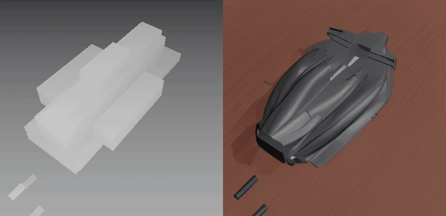

# F1 assembly: an interactive manual with a learned renderer

An agent builds a 3D assembly manual out of crude primitives, boxes and
cylinders only. A learned renderer turns that blockout into a photographic
frame in real time, grounded on one reference photo of the parts laid out on a
bench. The point of the split is that **no CAD ever reaches the model**: it
receives depth, a flat colour map and a memory picture rendered from the
agent's own boxes, and whatever detail appears in the output was added by the
model.

The object is a 3D printed Formula One kit: 23 parts, 17 assembly steps. It
was chosen over furniture because an agent cannot reproduce it from the manual
alone and its structure is much less regular.

Left is everything the model is given about shape: the depth of a handful of
boxes and cylinders. Right is what it renders from that. The wings, the
suspension arms and the surface detail are not in the input, so the model is
filling in geometry, not just shading it. Full clip: [`docs/manual_demo.mp4`](docs/manual_demo.mp4).

## Layout

| path | what it is |
| --- | --- |
| `viewer/index.html` | the manual itself: two synchronised scenes, hover identification, per-step guidance, glue placement, insertion axes. Also the data capture harness (`?traj=1`, `?pairs=1`, `?sch=1`) and the live client for the render service |
| `viewer/viewer_manifest.json` | per-part pose, dimensions, role, group; the 17 steps and their joints |
| `viewer/glue_sites.json` | contact patches between registered parts: where glue goes, over what area, along which insertion axis |
| `geometry/assemble.py` | slices `Tyres.stl` into the four wheel meshes and writes `assembly_final.json` |
| `geometry/register_parts.py` | registers each separate STL into the assembled reference by exact triangle congruence, then ICP |
| `geometry/contacts.py` | extracts contact patches between registered parts and derives insertion axes |
| `renderer/train_memory_cn.py` | trains the renderer |
| `renderer/serve_render.py` | the GPU service the manual talks to over a websocket |
| `renderer/render_video.py` | replays a captured interaction through a checkpoint, side by side with the truth |
| `renderer/eval_memory.py` | paired A/B measuring whether the memory channels are used at all |

## What is and is not in the repo

The CAD **is** included: the 24 part STLs the viewer loads sit in
`viewer/Separate STLs/` and `viewer/tyres/`, so the manual runs as soon as you
clone. They are a third-party 3D printed kit, redistributed here for research
reproducibility.

Not included, and why:

| what | effect | note |
| --- | --- | --- |
| the training data, ~2GB | none | the capture harness regenerates it from the manual in ~45 minutes |
| trained checkpoints | none | retrain, ~1 hour |
| the assembled reference STL, 40MB | `geometry/register_parts.py` cannot be re-run | its output is already committed as `viewer/registration.json`, so registration does not need repeating. Drop the file into `viewer/` if you want to redo it |
| decal images | decals unavailable | cut from a real livery sheet; off by default (`decalsOn = false`) |
| `grounding/index.json` and images | the grounding chooser disappears | the fetch is wrapped in try/catch |

Python dependencies are in `requirements.txt`. The viewer loads three.js r160
from unpkg, so the browser needs network access.

Step by step instructions, with a verification check at each stage, are in
[`docs/REPRODUCE.md`](docs/REPRODUCE.md). What was learned building it, and
which of it generalises, is in [`docs/INSIGHTS.md`](docs/INSIGHTS.md).

## The renderer

Stable Diffusion 1.5 with a fine-tuned depth ControlNet. SD, the VAE and the
IP-Adapter stay frozen; only the ControlNet trains. Its first layer is widened
from three input channels to nine:

| channels | input | why |
| --- | --- | --- |
| 0-2 | blockout depth | the geometry the agent actually built |
| 3-5 | flat per-part colour | colour is an input, so it is never invented or drifted |
| 6-8 | memory picture | what the object looked like a moment ago, for consistency across frames |

The six new channels are zero-initialised, so an untrained model behaves
exactly like stock ControlNet and training can only add.

Two details matter more than they look:

**The memory is conditioning, not a starting latent.** An earlier version
chained frames by starting the sampler from the previous frame, which made
every frame inherit the last one's defects until a forced reset snapped it
back. Here each frame is denoised from pure noise and the previous frame only
advises, so nothing compounds.

**Training uses the model's own output as memory.** Feeding captured frames as
memory teaches the model to trust something it never gets at serving time,
where memory is its own flawed render. So every 200 steps the trainer replays
five consecutive frames, rendering each one and passing its own output forward.
Memory is also drawn from anywhere in the step rather than one frame back, and
12% of the time is deliberately the wrong frame with the target still correct,
which teaches it to take position from the depth and only appearance from the
memory.

## Running it

Capture the training data from the manual (Chrome, tab in front):

    cd viewer && python3 capture_server.py 8078 traindata
    # http://localhost:8078/index.html?traj=1     interactions with actions
    # http://localhost:8078/index.html?pairs=1    independent viewpoints
    # http://localhost:8078/index.html?sch=1      line-art schematics

Train:

    python train_memory_cn.py --data <traindata> --out memory_cn9 \
        --steps 12000 --bs 8 --res 384

It writes a checkpoint and a short held-out clip every 1000 steps, rendered the
way it is served, so flicker and drift are visible rather than hidden behind a
still.

Serve, and point the manual at it:

    python serve_render.py --memory-cn memory_cn9/controlnet --res 384 \
        --port 8903 --ws websockets-sansio --fast --steps 4 --tiny-vae --compile
    # http://localhost:8078/index.html#api=http://localhost:8903

About 8 fps at 384 on an H200. Transport and browser readback put a floor of
roughly 25 to 35 ms per frame, so this design tops out near 30 fps however
cheap the model gets.

## Status

Overfit to this one kit, by design. Colour stability and temporal consistency
are still imperfect when the camera turns quickly. The open questions are
whether it transfers to a second object and what the scaling curve looks like.
